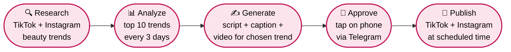
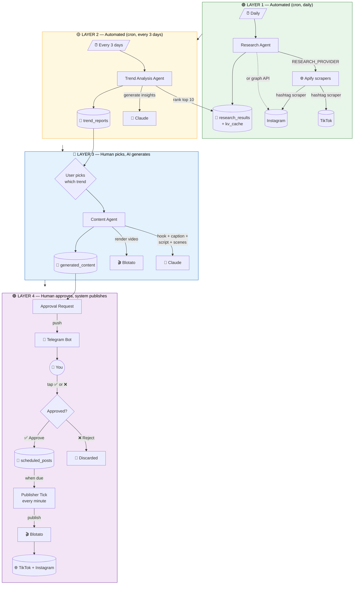
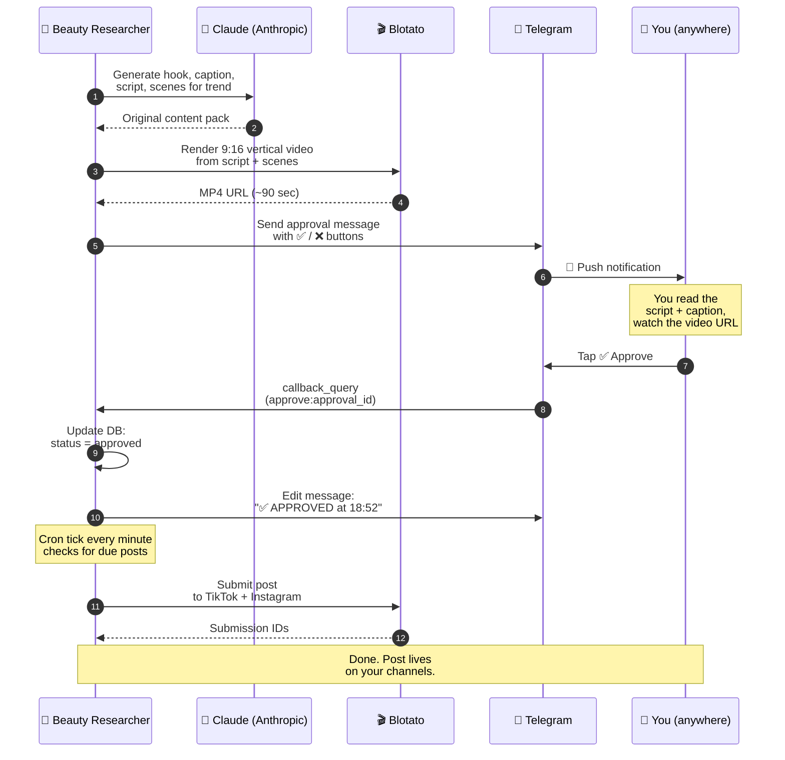
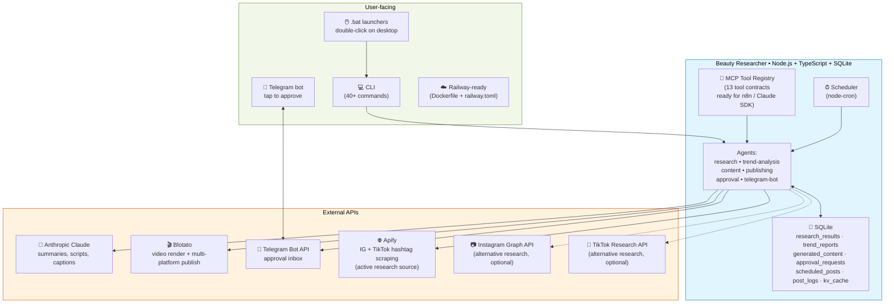

# Workflow diagrams (for demo)

Three views of the same system, optimized for a meeting audience.

> **How to show these in your meeting:**
> - **Easiest:** open this page on GitHub — every diagram renders automatically as an interactive image. Share screen and zoom. URL: https://github.com/naor705/Beauty_project/blob/main/docs/WORKFLOW_DIAGRAM.md
> - **For slides (PNG/SVG):** copy any diagram's code block (everything between ` ```mermaid ` and ` ``` `), paste into **https://mermaid.live**, click **Actions → Download PNG/SVG**, embed in your slide.
> - **In VS Code:** install the "Markdown Preview Mermaid Support" extension, then preview this file (Ctrl+Shift+V).

---

## 1. The Big Picture — what the system does

The simple 5-step story for a non-technical audience.



**Key idea:** AI does the heavy lifting (research + creation), human approves from phone, posts go out automatically.

---

## 2. End-to-end Pipeline — what happens when

Shows the four layers of the system, what's automatic vs. what waits for you.



**Talking points for the meeting:**
- 🟢 + 🟡 happen on a schedule with **zero human input**
- 🔵 is the only step where you decide *what* to make
- 🟣 is **gated by your tap** — nothing posts without explicit approval

---

## 3. The Approval UX — the moment that matters

Shows the back-and-forth between system and human at approval time. This is the slide that closes the demo.



**Demo line:** *"From discovering a viral trend to a published post on TikTok and Instagram — the only thing that touched a human was one tap on the phone."*

---

## 4. Tech Stack (for technical audience)

If anyone in the meeting is technical and asks "what's under the hood":



---

## How to export for slides — step by step

1. Pick the diagram you want
2. Copy everything between ` ```mermaid ` and the closing ` ``` ` (just the diagram code)
3. Open **https://mermaid.live** in your browser
4. Paste the code into the left panel — it renders instantly on the right
5. Click **Actions** (top-right of the right panel) → **Download PNG** (high-res) or **Download SVG** (scalable)
6. Drag the downloaded file into your Google Slides / PowerPoint / Keynote

**Pro tip:** SVG is better for slides because it scales without pixelation. PNG works everywhere.

## Customizing the diagrams

These are plain text — change a label, add a node, swap colors. After editing this file:

```powershell
git add docs/WORKFLOW_DIAGRAM.md
git commit -m "Update workflow diagrams"
git push
```

GitHub re-renders within a few seconds. The mermaid.live editor also has a live preview you can iterate on without committing.
